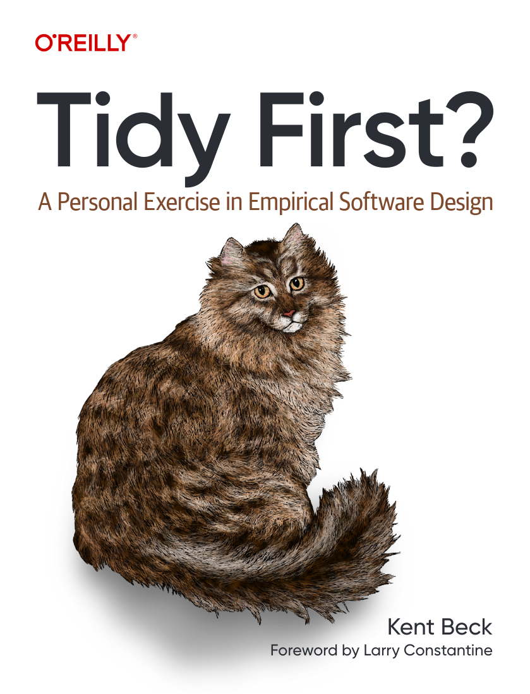
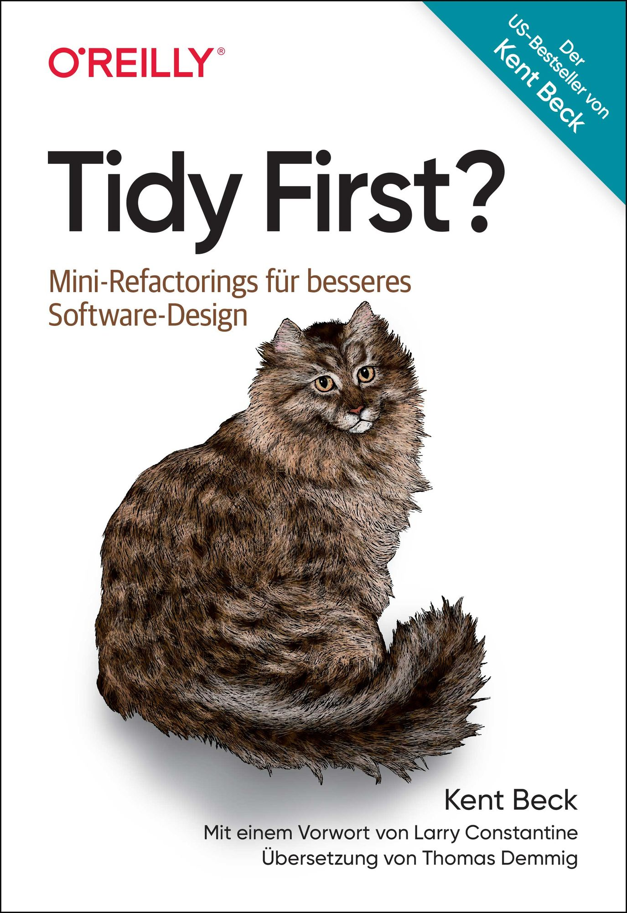
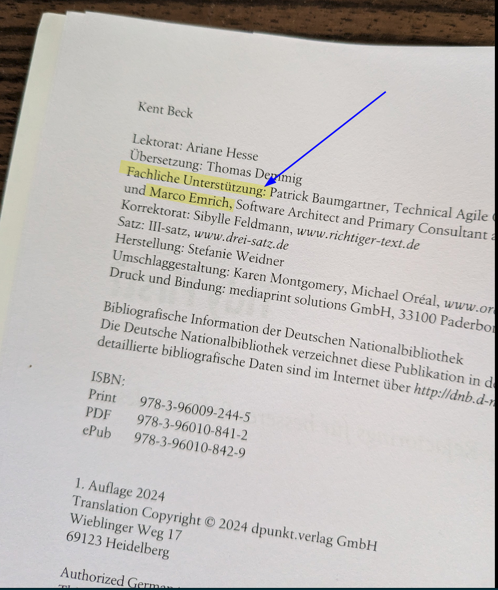
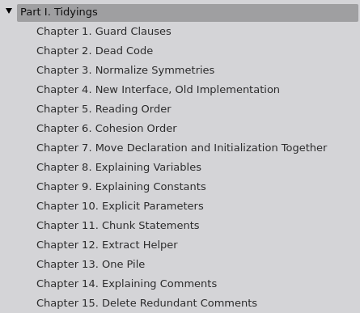

---
# You can also start simply with 'default'
theme: default
# random image from a curated Unsplash collection by Anthony
# like them? see https://unsplash.com/collections/94734566/slidev
title: Tidy First
info: |
  ## Tidy First
class: text-center
# https://sli.dev/custom/highlighters.html
highlighter: shiki
# https://sli.dev/guide/drawing
drawings:
  persist: false
# slide transition: https://sli.dev/guide/animations#slide-transitions
transition: none
# enable MDC Syntax: https://sli.dev/guide/syntax#mdc-syntax
mdc: true
---

---
layout: cover
background: images/title.jpg
class: text-center
---


# Tidy First?

<div text-3xl>
  a Book by Kent Beck

  Presentation by

  Marco Emrich (codecentric)
</div>

---
layout: image
image: images/nue.png
---

---
layout: image
image: images/nue2.png
---

---
layout: image
image: images/nue3.png
---

---
layout: two-cols
---

# Facts about the book

 * O'Reilly
 * First of Three Books
 * Concise, read it in one go
 * ~120 pages

:: right ::



---
layout: two-cols
---

# German Version

 * O'Reilly / DPunkt (German version)
 * ~120 pages

:: right ::



---
layout: two-cols
---

# My Role




:: right ::


---
layout: cover
background: images/spoiler2.png
---


---
layout: image-right
image: images/toc1.png
---


---
layout: full
---


---
layout: image-right
image: images/discussion.jpg
class: text-center
---
# Discussion

<div bg-yellow-100 rounded border-4 h-60 align-middle py-20 text-3xl>
    <p>What is Refactoring</p>
    <p>...for you?</p>
</div>

<div text-6xl my-20>5 min</div>
---
layout: image-left
image: images/discussion.jpg
class: text-center
---

# Discussion

<div bg-yellow-100 rounded border-4 h-60 align-middle py-10 text-3xl>
    <p>What do your company think of refactoring?</p>
    <p>... what your managers?</p>
</div>

<div text-6xl my-20>5 min</div>

---
layout: cover
background: images/results.jpg
class: text-center
---
<h1 mt-50 text-indigo-300>RESULTS!</h1>

---
layout: image-left
image: images/fowler.jpg
class: text-2xl
---

# Definition

**Refactoring (verb)**: to restructure software by applying a series of refactorings without changing its observable behavior.

**Refactoring (noun)**: a change made to the internal structure of software to make it easier to understand and cheaper to modify without changing its observable behavior.


<p>&mdash; Martin Fowler</p>

---
layout: image-right
image: images/beck.jpeg
class: text-2xl
---

“Refactoring” took fatal damage when folks started using it to refer to long pauses in feature development.

They even eliminated the “that don’t change behavior” clause, so “refactoring” could easily break the system. Let’s see: no new features, possible damage, and nothing to show for it at the end. No thank you.


<p>&mdash; Kent Beck</p>

---
layout: image
image: images/burn.jpg
---
---
layout: image-right
image: images/fuzzy.jpg
class: text-2xl
---

Tidyings are the cute, fuzzy little refactorings that nobody
could possibly hate on.

<p>&mdash; Kent Beck</p>

<!--

Tidyings sind wirklich wirklich klein!

es hilf evtl in manchen Kontexten nicht von Refactoring zu sprechen
Wenn Du das Problem nicht hast, kann Du gerne weiterhin von Refactoring sprechen.

-->
---

# When to Tidy?

---
layout: image-right
image: images/discussion.jpg
class: text-center
---
# Discussion

<div bg-yellow-100 rounded border-4 h-60 align-middle py-20 text-3xl>
    <p>Why should we tidy?</p>
    <p>When should we tidy?</p>
</div>

<div text-6xl my-20>5 min</div>

---
layout: image-left
image: images/t-never3.png
---

# Tidy Never?

 * "never changing this code again" - rare, but happens
 * no learning

---
layout: image-left
image: images/t-later.png
---
# Tidy Later?

 * It might not happen? - excuse?
 * Fun List (Tidy before the next feature)
 * Creates Value ("reduce tax of messiness")
 * As a learning tool
 * Bring you joy (Motivation)

---
layout: image-left
image: images/t-first3.png
---

# Tidy After?

* "change the same area again. Soon."
* "cheaper to tidy now."
* "...Proportion to the cost of behavior changes."


---
layout: image-left
image: images/t-first2.png
---

# Tidy First?

 * "It Depends" ... but bias to...
 * easier, than the messy change?
 * Help your comprehension?
 * amortize?


---
layout: cover
background: images/title.jpg
class: text-center
---

# Tidyings!




---

<v-click>

# Guard Clauses

</v-click>

````md magic-move {lines: true}
```ts
function calculateDiscount(price: number, isHoliday: boolean, isVIP: boolean) {
    let discount = 0;
    if (isHoliday) {
        if (!isVIP) {
            discount = price * 0.1;
        }
    }
    return discount;
}
```

```ts
function calculateDiscount(price: number, isHoliday: boolean, isVIP: boolean) {
    if (!isHoliday) return 0;
    if (isVIP) return 0;

    return price * 0.1;
}
```


````

---

# Guard Clauses

```ts
function calculateDiscount(price: number, isHoliday: boolean, isVIP: boolean) {
    let discount = 0;
    if (isHoliday) {
        if (!isVIP) {
            discount = price * 0.1;
        }
    }
    return discount;
}
```

<arrow  x1="350" y1="240" x2="350" y2="350" color="#953" width="2" z-40 arrowSize="1" />

<div mt-20>

```typescript
function calculateDiscount(price: number, isHoliday: boolean, isVIP: boolean) {
    if (!isHoliday) return 0;
    if (isVIP) return 0;

    return price * 0.1;
}
```

</div>


---
layout: two-cols
---
<v-click>

# Dead Code

</v-click>

<div w-105>

````md magic-move {lines: true}

```ts
class BankAccount {
    private balance: number = 0;
    private transactionHistory: number[] = [];

    private calculateAverageTransaction(): number {
        const sum = this.transactionHistory.reduce(
          (a, b) => a + b, 0);
        return sum / this.transactionHistory.length;
    }

    public getBalance(): number {
        return this.balance;
    }

    public printStatementFormA(): void {
        console.log("Balance: ", this.getBalance());
        console.log("Average Transaction: ",
          this.calculateAverageTransaction());
    }

    public printStatementFormB(): void {
        console.log("Balance: ", this.getBalance());
        console.log(account.getTransactionHistory());
    }

```

```ts
class BankAccount {
    private balance: number = 0;
    private transactionHistory: number[] = [];

    public getBalance(): number {
        return this.balance;
    }

    public printStatementFormB(): void {
        console.log("Balance: ", this.getBalance());
        console.log(account.getTransactionHistory());
    }

```

````
</div>


::right::

```ts
    public deposit(amount: number): void {
        this.balance += amount;
        this.transactionHistory.push(amount);
    }

    public getTransactionHistory(): number[] {
        return this.transactionHistory;
    }

    public withdraw(amount: number): void {
        if (amount <= this.balance) {
            this.balance -= amount;
            this.transactionHistory.push(-amount);
        } else {
            console.log("Insufficient balance");
        }
    }
}

const specialTransactionPrint =
    (inValueFromT1, inValueFromT2, outValueFromT3) => {
        const account = new BankAccount();
        account.deposit(inValueFromT1);
        account.deposit(inValueFromT2);
        account.withdraw(outValueFromT3);
        printStatementFormB();
}
```

```ts
    public deposit(amount: number): void {
        this.balance += amount;
        this.transactionHistory.push(amount);
    }

    public getTransactionHistory(): number[] {
        return this.transactionHistory;
    }

    public withdraw(amount: number): void {
        if (amount <= this.balance) {
            this.balance -= amount;
            this.transactionHistory.push(-amount);
        } else {
            console.log("Insufficient balance");
        }
    }
}

const specialTransactionPrint =
    (inValueFromT1, inValueFromT2, outValueFromT3) => {
        const account = new BankAccount();
        account.deposit(inValueFromT1);
        account.deposit(inValueFromT2);
        account.withdraw(outValueFromT3);
        printStatementFormB();
}
```


---

<v-click>

# Normalize Symmetries

</v-click>

````md magic-move {lines: true}
```java
public class Person {
...
    // Using string concatenation
    public String getFullName() {
        return firstName + " " + lastName;
    }

    // Using String.format
    public String getLocation() {
        return String.format("%s, %s", city, country);
    }

    // Using StringBuilder
    public String getDetailedInfo() {
        return new StringBuilder(firstName).append(" ").append(lastName)
                .append(" from ").append(city).append(", ").append(country).toString();
    }
}
```

```java
public class Person {
...
    public String getFullName() {
        return firstName + " " + lastName;
    }

    public String getLocation() {
        return city + ", " + country;
    }

    public String getDetailedInfo() {
        return firstName + " " + lastName + " from " + city + ", " + country;
    }
}
```
````
---
layout: default
---

<div mt--10>

```java
    // Using string concatenation
    public String getFullName() {
        return firstName + " " + lastName;
    }
    // Using String.format
    public String getLocation() {
        return String.format("%s, %s", city, country);
    }
    // Using StringBuilder
    public String getDetailedInfo() {
        return new StringBuilder(firstName).append(" ").append(lastName)
                .append(" from ").append(city).append(", ").append(country).toString();
    }
```
</div>

<arrow  x1="350" y1="245" x2="350" y2="330" color="#953" width="2" z-40 arrowSize="1" />


<div mt-20>

```java
    public String getFullName() {
        return firstName + " " + lastName;
    }

    public String getLocation() {
        return city + ", " + country;
    }

    public String getDetailedInfo() {
        return firstName + " " + lastName + " from " + city + ", " + country;
    }
```

</div>

---

# New Interface, Old Implementation

```python
class Database:
    def connect(self, url, username, password):
        ...

    def execute_query(self, query):
        ...

    def disconnect(self):
        ...
```
<arrow  x1="350" y1="245" x2="350" y2="310" color="#953" width="2" z-40 arrowSize="1" />

<div mt-10>

```python
    def connect(self, url, username, password):
    def execute_query(self, query):
    def disconnect(self):

    def execute_query(self, url, username, password, query):
        self.connect(url, username, password)
        self.execute_query(query)
        self.disconnect()
```
</div>

#### Usage
```python
db = Database()
db.execute_query("url", "username", "password", "SELECT * FROM table")
```

---

<v-click>

# Reading Order

</v-click>

````md magic-move {lines: true}
```python
class Car:
    def start_engine(self):
        if self.check_battery():
            print("Engine started.")
        else:
            print("Engine failed to start. Battery is dead.")

    def __init__(self, make, model, year, color):
        self.make = make
        self.model = model
        self.year = year
        self.color = color

    def check_battery(self):
        # For simplicity, let's assume the battery is good if the car is less than 5 years old
        return datetime.datetime.now().year - self.year < 5
```

```python
class Car:
    def __init__(self, make, model, year, color):
        self.make = make
        self.model = model
        self.year = year
        self.color = color

    def check_battery(self):
        # For simplicity, let's assume the battery is good if the car is less than 5 years old
        return datetime.datetime.now().year - self.year < 5

    def start_engine(self):
        if self.check_battery():
            print("Engine started.")
        else:
            print("Engine failed to start. Battery is dead.")

```
````


---


# Cohesion Order


````md magic-move {lines: true}
```python
class ShoppingCart:
    def __init__(self):
        self.items = []

    def apply_discount(self, code):
        if self.is_valid_discount_code(code):
            total = self.calculate_total()
            print(f"Total after discount: {total * 0.9}")
        else:
            print("Invalid discount code.")

    def add_item(self, name, price, quantity):
        self.items.append({'name': name, 'price': price, 'quantity': quantity})

    def calculate_item_total(self, item):
        return item['price'] * item['quantity']

    def calculate_total(self):
        ...

    def is_valid_discount_code(self, code):
        return code.startswith("DISC")

```

```python
class ShoppingCart:
    def __init__(self):
        self.items = []

    def add_item(self, name, price, quantity):
        self.items.append({'name': name, 'price': price, 'quantity': quantity})

    def calculate_item_total(self, item):
        return item['price'] * item['quantity']

    def calculate_total(self):
        ...

    def is_valid_discount_code(self, code):
        return code.startswith("DISC")

    def apply_discount(self, code):
        if self.is_valid_discount_code(code):
            total = self.calculate_total()
            print(f"Total after discount: {total * 0.9}")
        else:
            print("Invalid discount code.")
```
````


---

# Move Declaration an Initialization Together


```ts
    let total: number;
    // ...some code that doesn't use total
    total = 0;
    for (let item of items) {
        let price: number;
        // ...some more code, maybe it uses total but doesn't use price
        price = item.price;
        total += price * item.quantity;
    }
    return total;
```

<arrow  x1="350" y1="270" x2="350" y2="380" color="#953" width="2" z-40 arrowSize="1" />

<div mt-20>

```ts
    let total = 0;
    // ...some code that doesn't use total
    for (let item of items) {
        let price: number;
        // ...some more code, maybe it uses total but doesn't use price
        price = item.price;
        total += price * item.quantity;
    }
    return total;
```
</div>

---

<v-click>

# Explaining Variables

</v-click>

```python
def calculate_point():
    return (math.sqrt(16) * math.sin(math.radians(45)), math.sqrt(16) * math.cos(math.radians(45)))
```


<v-click>

<arrow  x1="350" y1="140" x2="350" y2="220" color="#953" width="2" z-40 arrowSize="1" />

<div mt-20>


```python
def calculate_point():
    radius = math.sqrt(16)
    angle_in_radians = math.radians(45)

    x = radius * math.sin(angle_in_radians)
    y = radius * math.cos(angle_in_radians)

    return (x, y)
```

</div>

</v-click>

---

# Explaining Constants

```ts
function handleResponse(response: {code: number, data: any}): void {
    if (response.code === 404) {
        console.log("Page not found.");
    } else if (response.code === 200) {
        console.log("Success!");
    }
}
```

<v-click>

<arrow  x1="350" y1="240" x2="350" y2="320" color="#953" width="2" z-40 arrowSize="1" />

<div mt-20>

```ts
const PAGE_NOT_FOUND = 404;
const SUCCESS = 200;

function handleResponse(response: {code: number, data: any}): void {
    if (response.code === PAGE_NOT_FOUND) {
        console.log("Page not found.");
    } else if (response.code === SUCCESS) {
        console.log("Success!");
    }
}
```


</div>

</v-click>


---

# Explicit Parameters

```java
    public static void main(String[] args) {
        HashMap<String, Integer> params = new HashMap<>();
        params.put("width", 10);
        params.put("height", 20);
        calculateArea(params);
    }
    static void calculateArea(HashMap<String, Integer> params) {
        int area = params.get("width") * params.get("height");
        System.out.println("Area: " + area);
    }
```

<arrow x1="350" y1="270" x2="350" y2="340" color="#953" width="2" z-40 arrowSize="1" />

<div mt-10>

```java
    public static void main(String[] args) {
        HashMap<String, Integer> params = new HashMap<>();
        params.put("width", 10);
        params.put("height", 20);
        calculateArea(params.get("width"), params.get("height"));
    }
    static void calculateArea(int width, int height) {
        int area = width * height;
        System.out.println("Area: " + area);
    }
```

</div>


---
layout: image-left
image: images/title.jpg
---

# More Tidyings

* Chunk Statements
* Extract Helpers
* One Pile
* Explaining Comments
* Delete Redundant Comments
* even more...

---
layout: cover
background: images/exercise4.png
class: text-center
---


<h1 mt-105>EXERCISE</h1>

---

# Clicks Animations

You can add `v-click` to elements to add a click animation.

<div v-click>

This shows up when you click the slide:

```html
<div v-click>This shows up when you click the slide.</div>
```

</div>

<br>

<v-click>

The <span v-mark.red="3"><code>v-mark</code> directive</span>
also allows you to add
<span v-mark.circle.orange="4">inline marks</span>
, powered by [Rough Notation](https://roughnotation.com/):

```html
<span v-mark.underline.orange>inline markers</span>
```

</v-click>

<div mt-20 v-click>

[Learn More](https://sli.dev/guide/animations#click-animations)

</div>


